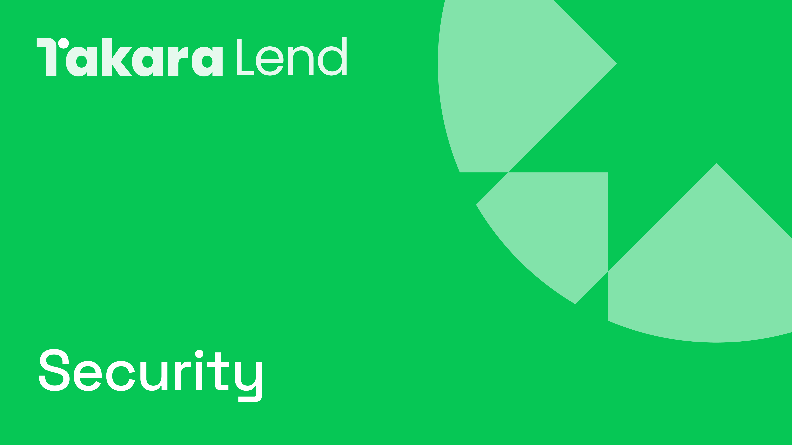

# 🛡️ 安全性

<figure><figcaption></figcaption></figure>

## Takara 安全措施

Takara 致力于为其用户提供一个安全可靠的协议。为此，它实施了一套强有力的安全措施，旨在最小化风险、解决潜在的漏洞，并确保协议的完整性和韧性。

以下是已实施的安全措施：

1. **安全审计**

Takara 的智能合约和系统已由一家或多家顶级安全公司进行了全面审计。这些审计涉及对协议代码库的深入分析，以发现和减轻潜在的安全漏洞，并确保遵循最佳实践。Takara 的贡献者与审计员紧密合作，解决任何发现的问题，从而增强协议的整体安全性。

为了进一步增强安全性，Takara 已与[**Zellic Security**](https://www.zellic.io/)——一家领先的区块链安全公司——建立了合作关系。此合作使得 Takara 能够及时发现并解决新的漏洞，确保协议在长期内保持安全和韧性。

2. **动态价格预言机**

Takara 利用多个价格预言机确保价格信息的准确性和可靠性。系统动态选择 [API3](https://api3.org/)、[Redstone](https://www.redstone.finance/) 和 [Pyth](https://www.pyth.network/) 作为资产的预言机定价来源，从而确保在某个预言机不可用时仍能提供无缝的连续性。

这一动态预言机系统减少了价格操控的风险，这是保持协议完整性并保护用户资金的关键。

3. **安全模块（即将完成）**

Takara 安全模块为意外事件提供额外的保护层，例如智能合约漏洞、清算失败或预言机故障。该模块集成到 Takara 的安全框架中，增强了协议的韧性并确保更高的可靠性。

