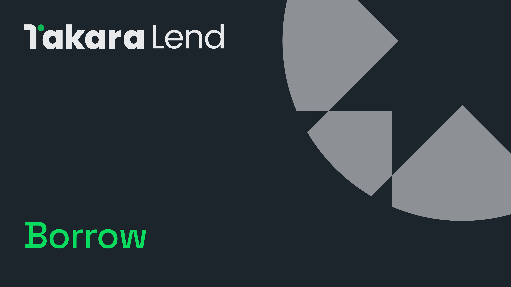

# 🤝 借贷

<figure><figcaption></figcaption></figure>

Takara 允许用户利用或“抵押”其数字资产，以借入其他资产。通过向 Takara 协议提供资产，用户可以获得超额抵押贷款。

最大借贷能力由所提供的抵押品价值以及 Takara 治理设定的参数决定。

## **支持的资产**



*  SEI (SEI)
*  iSEI (iSEI)
*  USDT (Tether USD)
*  USDC (USD Coin)
*  fastUSD (fastUSD)


