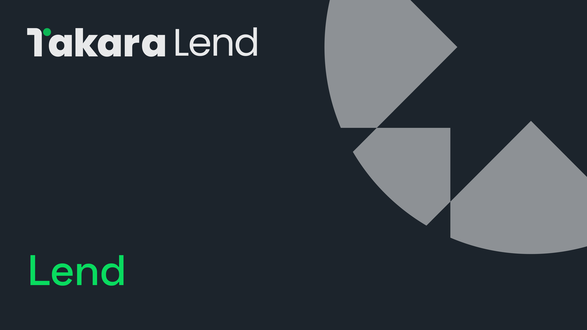

# 🤝 出借

<figure><figcaption></figcaption></figure>

Takara 允许用户在单边流动性池中出借资产（通常称为货币市场），并获得浮动利率收益。在 Takara 平台上出借数字资产同时也是借款其他资产的前置步骤。


[supply.md](supply.md)



[withdraw.md](withdraw.md)



[claiming-rewards.md](claiming-rewards.md)



[lend-faq.md](lend-faq.md)


## **支持的资产**



*  SEI (SEI)
*  iSEI (iSEI)
*  USDT (Tether USD)
*  USDC (USD Coin)
*  fastUSD (fastUSD)



