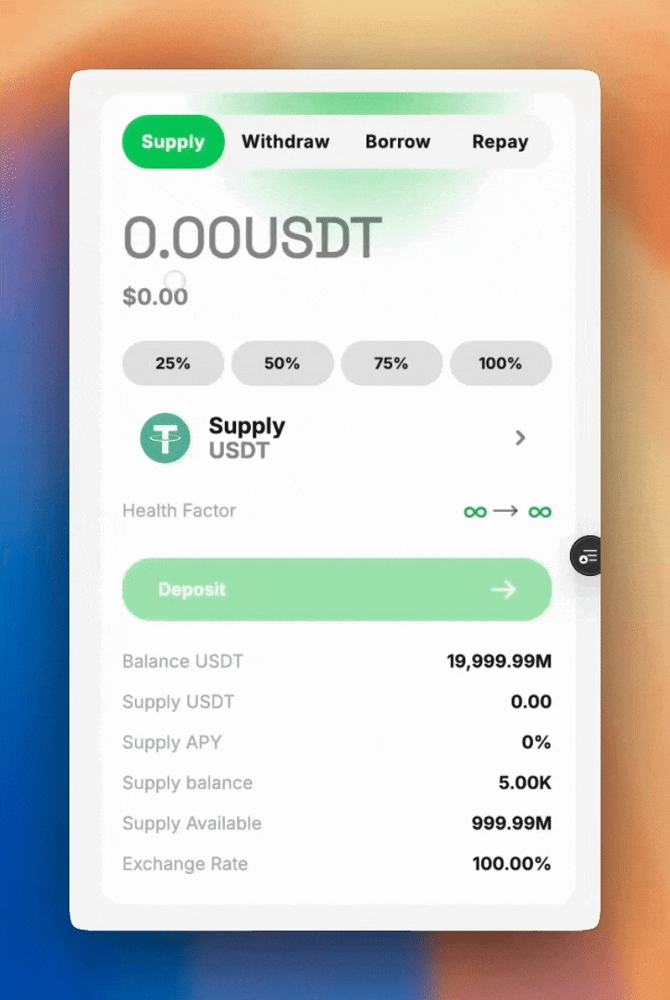

# 出借/存入资产

## 关于 

出借您的资产即可开始赚取浮动利率和奖励。

## **前提条件**

1. [钱包连接](../quickstart/wallet-connection.md)  
   * 开始之前，请将钱包连接至 Takara 应用程序。
2. 持有 Takara 支持的资产。  
   * 所有支持的资产均列于 [Markets](https://dapp.takaralend.com/market)。

## 如何出借

### 第一步：选择要出借的资产

**选项 1**

1. 进入 "Dashboard" 页面。

<figure><picture><source srcset="../../.gitbook/assets/Screenshot 2025-01-19 at 6.33.41 PM.png" media="(prefers-color-scheme: dark)"></picture><figcaption></figcaption></figure>

2. 在 "**Supply**" 弹窗中，从下拉菜单中选择您想要出借的资产。

<figure><figcaption>
点击资产按钮以显示所有资产
</figcaption></figure>

**选项 2**

1. 进入 "[**Markets**](https://moonwell.fi/markets)" 页面。

<figure><picture><source srcset="../../.gitbook/assets/Screenshot 2025-01-19 at 6.48.32 PM.png" media="(prefers-color-scheme: dark)"></picture><figcaption></figcaption></figure>

2. 点击您希望出借的资产旁的 "**Supply**" 按钮。

<figure><figcaption>
点击 "Supply" 将跳转至所选资产的 "Lend" 页面。
</figcaption></figure>

### 第二步：完成存入交易

1. 在 "**Supply**" 弹窗中，输入您希望存入的金额。

<figure><figcaption>
输入期望存入的金额
</figcaption></figure>

2. 点击 "**Deposit**" 按钮以发起交易。

<figure><figcaption></figcaption></figure>

3. 签署交易并等待交易完成。  
4. 恭喜！您已成功向 Takara 存入资产。

<figure><figcaption></figcaption></figure>


交易确认后，您将获得对应于存入资产的 tTokens。tTokens 是可转让、带收益的 ERC-20 代币，代表用户在 Takara 上的持仓状态。

每种 Takara 支持的资产均对应一个 tToken。例如，mUSDT 表示在 Sei V2 上铸造的 USDT 代币版本。

