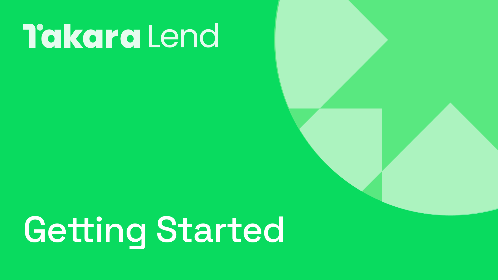

# 💠 快速开始

<figure><figcaption></figcaption></figure>

使用 Takara 的第一步是连接钱包。

Takara 部署于 Sei Networks V2，该网络兼容以太坊虚拟机（EVM）。这种兼容性确保了广泛的钱包均可支持 Takara。

在完成 [钱包连接](wallet-connection.md) 后，用户将可完全访问 Takara 的各项功能，包括出借、借款和质押。


如果您使用的是 Sei V1 钱包，您需要将 EVM 地址与 Sei 地址进行关联。这是 Sei V2 所必需的。[了解更多 ↗](https://seistartguide.addpotion.com/)

